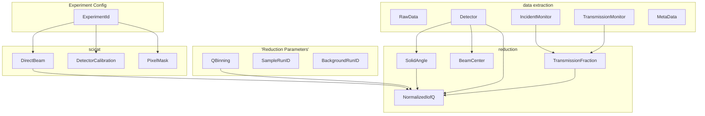

# Workflow Design

## Traditional data-reduction workflows

Traditionally, users are supplied with a toolbox of algorithms and optionally a reduction script or notebooks that uses those algorithms.
Conceptually this looks similar to the following:

```python
sample = load_sample(run=12345)
background = load_background(run=12300)
direct_beam = load_direct_beam(run=10000)
mask_detectors(sample)
mask_detectors(background)
sample_monitors = preprocess_monitors(sample)
background_monitors = preprocess_monitors(background)
transmission_fraction = transmission_fraction(**sample_monitors)
sample_iofq = compute_i_of_q(sample, direct_beam, transmission_fraction)
transmission_fraction = transmission_fraction(**background_monitors)
background_iofq = compute_i_of_q(background, direct_beam, transmission_fraction)
iofq = subtract_background(sample_iofq, background_iofq)
```

This is an *imperative workflow*, where the user specifies the order of operations and the dependencies between them.
This is not ideal for a number of reasons:

- The user has to know the order of operations and the dependencies between them.
- The user has to know which algorithms to use.
- The user has to know which parameters to use for each algorithm.
- The user has to know which data to use for each algorithm.
- The user can easily introduce mistakes into a workflow, e.g., by using the wrong order of operations, or by overwriting data.
  This is especially problematic in Jupyter notebooks, where the user can easily run cells out of order.

Our most basic programming models provide little help to the user.
For example we typically write components of reduction workflows as functions of `scipp.Variable` or `scipp.DataArray` objects:

```python
def transmission_fraction(
    incident_monitor: sc.DataArray,
    transmission_monitor: sc.DataArray,
) -> sc.DataArray:
    return transmission_monitor / incident_monitor
```

Here, we rely on naming of function parameters as well as docstrings to convey the meaning of the parameters, and it is up to the user to pass the correct inputs.
While good practices such as keyword-only arguments can help, this is still far from a scalable and maintainable solution.

As an improvement, we could adopt an approach with more specific domain types, e.g.,

```python
def transmission_fraction(
    incident_monitor: IncidentMonitor,
    transmission_monitor: TransmissionMonitor,
) -> TransmissionFraction:
    return transmission_monitor / incident_monitor
```

We could now run [mypy](https://mypy-lang.org/) on reduction scipts, to ensure that the correct types are passed to each function.
However, with dynamic workflows, i.e., users modifying workflows in a Jupyter notebooks on the fly, this is not practical.
Aside from this, such an approach would still not help with the several of other issues listed above.


## High-level summary of proposed approach

We propose to use dependency injection to build a declarative workflow.
In the manner of a domain-driven design, we define components that correspond to concepts that are meaningful to the (instrument) scientist.

Specifically, we propose to define specific domain types, such as `IncidentMonitor`, `TransmissionMonitor`, and `TransmissionFraction` in the example above.
However, instead of the user having to pass these to functions, we use dependency injection to provide them to the functions.
In essence this will build a workflow's task graph, and the user will only have to specify the inputs and outputs of the workflow.

From the [Guice documentation](https://github.com/google/guice/wiki/MentalModel#injection) (Guice is a dependency injection framework for Java):

> "This is the essence of dependency injection. If you need something, you don't go out and get it from somewhere, or even ask a class to return you something. Instead, you simply declare that you can't do your work without it, and rely on Guice to give you what you need.
>
> This model is backwards from how most people think about code: it's a more *declarative model* rather than an *imperative one*. This is why dependency injection is often described as a kind of inversion of control (IoC)."
> (emphasis added)


## Domain-Driven Design

Domain-Driven Design (DDD) is an approach to software development that aims to make software more closely match the domain it is used in.
The obvious benefit of this is that it makes it easier for domain experts to understand and modify the software.

How should we define the domain for the purpose of data reduction?
Looking at, e.g., Mantid, we see that the domain is defined as data reduction for any typ of neutron scattering.
This has led to more than 1000 algorithms, making it hard for users to know how to use them.
Furthermore, while algorithms provide some sort of domain-specific language, the data types are generic and do not.

What we propose here is to define the domain more narrowly, specific to a technique or even specific to an instrument.
This will reduce the scope to cover in the domain-specific language.


## Dependency Injection

Dependency injection is a common technique for implementing the [inversion of control](https://en.wikipedia.org/wiki/Inversion_of_control) principle.
It makes components of a system more loosely coupled, and makes it easier to replace components, including for testing purposes.
Dependency injection can be performed manually, but there are also frameworks that can help with this.




### Examples

1. Swap provider of `TransmissionFraction` for provider that handles wide-angle-correction
2. Swap provider of `BeamCenter` for provider that returns a constant value.
   This could also be by setting the value in the reduction config.
   Note that the injection sytem must make sure to only allow for unique sources of thruth.

## Dask

We can use this to build a dask graph.
This will allow for computing intermediate results without recomputing everything for every subresult.

## Multiple injectors

## Meta data handling

## Reducing multiple runs

## Notes

Instead of user calling `injector.get(IofQ)`, let them declare a function that needs inputs (could be multiple), the injection system can compute and inject all of them.
Instead of:

```python
sample_iofq = injector.get(IofQ)
iofq = injector.get(BackgroundSubtractedIofQ)
sample_iofq, iofq = dask.compute([sample_iofq, iofq])
```

Use:

```python
def process_results(sample_iofq: IofQ, iofq: BackgroundSubtractedIofQ):
    pass

injector.call_with_injection(process_results)
```
