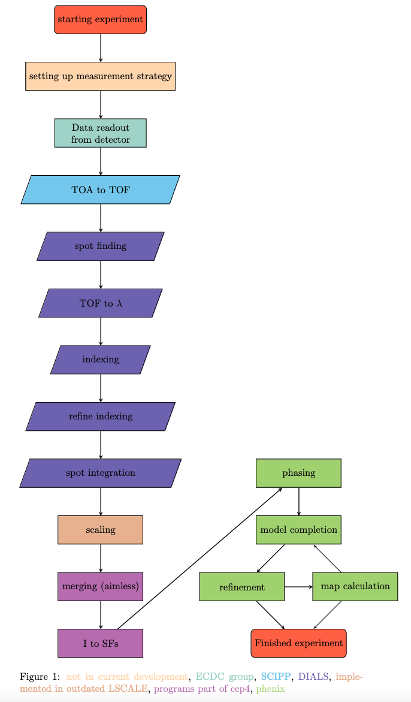

# Data Workflow Overview
This is an overall description of the data workflow for the NMX instrument at ESS.

The [NMX](https://europeanspallationsource.se/instruments/nmx) Macromolecular Diffractometer is a time-of-flight (TOF)
quasi-Laue diffractometer optimised for small samples and large unit cells
dedicated to the structure determination of biological macromolecules by crystallography.

The main scientific driver is to locate the hydrogen atoms relevant to the function of the macromolecule.

## Data reduction



### From single event data to binned image-like data (scipp)
The first step in the data reduction is to reduce the data from single event data to image-like data. <br>
Therefore the [essNMX](https://github.com/scipp/essnmx) package is used.

The time of arrival (TOA) should be converted into time of flight (TOF).
<!--Not implemented for measurement data-->
Then the single events get binned into pixels and then histogramed in the TOF dimension.  <br>
This result can be exported to an HDF5 file
along with additional metadata and instrument coordinates (pixel IDs).

See [workflow example](../examples/workflow) for more details.

### Spot finding and integration (DIALS)
For the next five steps of the data reduction from spot finding to spot integration,
we use a program called [DIALS](https://dials.github.io/index.html) [^1].
[^1]: [DIAL as a toolkit](https://onlinelibrary.wiley.com/doi/10.1002/pro.4224)

#### 1. Import Image-like Files

First, we use [dials.import](https://dials.github.io/documentation/programs/dials_import.html) to convert image data files into a format compatible with dials.

It processes the metadata and filenames of each image to establish relationships between different sets of images. <br>
Once all images are processed, the program generates an experiment object file, outlining the connections between the files. <br>
The images to be processed are designated as command-line arguments. <br>
Occasionally, there may be a restriction on the maximum number of arguments allowed on the command line, and the number of files could surpass this limit. <br>
In such cases, image filenames can be entered through stdin, as demonstrated in the examples below. <br>
The Format class for NMX is at modules/dxtbx/src/dxtbx/format/FormatNMX.py where beam-line-specific parameters and file format information are stored.

```console
dials.import *.nxs
```

#### 2. Search for Strong Pixels

The next step is to [search for strong pixels](https://dials.github.io/documentation/programs/dials_find_spots.html). <br>
In this step, the intensity of each pixel or a pixel group is compared with its local surroundings. <br>
With the information of strong pixels, strong spots are defined. <br>
To find these spots, the centroids and intensities will be calculated. <br>
The results can be visualised in the image viewer or the [dial browser](https://toastisme.github.io/dials_browser_experiment_viewer/).


```console
dials.find_spots imported.expt find_spots.phil
```

#### 3. Index Instrument Geometry

In the [indexing](https://dials.github.io/documentation/programs/dials_index.html) step the unit cell is determined. <br>
A list of indexed reflexes and an instrument model including a crystal model is returned. <br>
One-dimensional and three-dimensional fast Fourier transform-based methods are available.

As input parameters the ``imported.exp`` and ``strong.refl`` files are used. <br>
More parameters such as ``unit cell`` and ``spacegroup`` can be given.

```console
dials.index imported.expt strong.refl space_group=P1 unit_cell=a,b,c,alpha,beta,gamma
```

#### 4. Refine the Diffraction Geometry

The result of indexing the instrument geometry is then used to get refined diffraction geometry [^2].
[^2]: https://dials.github.io/documentation/programs/dials_refine

```console
dials.refine indexed.refl indexed.expt detector.panels=hierarchical
```

#### 5. Integrate Reflexes

The last step in DIALS is to integrate each reflex.[^3]
[^3]: https://dials.github.io/documentation/programs/dials_integrate.html

Currently, different approach is used to integrate the dimension of the image and the dimension of TOF. <br>
In the dimension of the image, a simple summation is used
and in the TOF dimension, a profile-fitting approach is used.

```console
dev.dials.simple_tof_integrate refined.expt refined.refl
```

### Scaling (LSCALE/pyscale)
Currently [LSCALE](https://scripts.iucr.org/cgi-bin/paper?S0021889898015350) can be used in a docker container which makes it indented from the OS. <br>
LSCALE is a program for scaling and normalisation of Laue intensity data.  <br>
The source code is available on [Zenodo](https://zenodo.org/records/4381992).  <br>
Since LSCALE is not maintained anymore we are currently developing a Python-based alternative to LSCALE called pyscale[^4].
[^4]: ``pyscale`` is under development and lives in a private repository. Please ask for access to the repository to the [owner](https://github.com/mlund) if needed.

**To start docker desktop**
```console
docker run -it -v $HOME:/mnt/host -v /tmp/.X11-unix:/tmp/.X11-unix -e DISPLAY=host.docker.internal:0 lscale
```
**Command to run ``lscale``**
```console
lscale < lscale.com > lscale.out
```

### Merge Intensities and Derive Structure Factors (CCP4, AIMLESS and CTRUNCATE)
[AIMLESS](https://www.ccp4.ac.uk/html/aimless.html) and [CTRUNCATE](https://www.ccp4.ac.uk/html/ctruncate.html) are sub-programs of [CCP4](https://www.ccp4.ac.uk/html/).

[AIMLESS](https://www.ccp4.ac.uk/html/aimless.html) can scale multiple observations of reflections together. <br>
It can also merge multiple observations into an average intensity.

[CTRUNCATE](https://www.ccp4.ac.uk/html/ctruncate.html) converts measured intensities into structure factors. <br>
CTRUNCATE includes corrections for weak reflections to avoid negative intensities due to background corrections.

This step can be done via GUI interfaces of ``CCP4``.
1. Start ``CCP4`` GUI
2. Go to ``all programs``
3. Select ``Aimless``
4. Select ``scaled *mtz file``

Parameters can be modified. <br>
Standard parameters are fine in most cases.

The ``mtz`` file can be used in a standard protein crystallographic program to solve and refine the structure.
